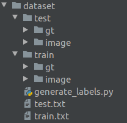

# Lite-DBNet

## 数据准备
以icdar2015数据集为例，下载数据集解压到工作目录dataset下，整理如下图所示：  
  

使用generate_labels.py分别生成train.txt和test.txt文件。

## 参数配置
根据需求修改config中的config.py文件。

## 启动训练

```shell
python train.py
```

## 安装配置
pytorch >=1.6.0  
python >= 3.6